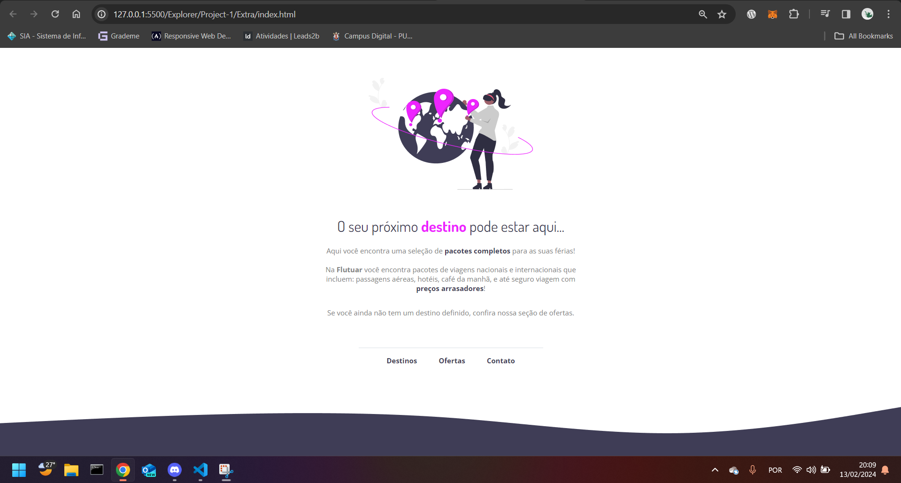

# Flutuar - Custom Travel Packages

## Description
"Flutuar" is a project developed during the Rocketseat Explorer course, led by instructor Mayk Brito.

## Project Features
- **Custom Travel Packages:** Offers a selection of national and international travel packages.
- **Unique Destinations:** Focuses on providing unique travel experiences to users.
- **Comprehensive Offerings:** Packages include airfare, accommodation, breakfast, and travel insurance.
- **Engaging Design:** Utilizes vibrant colors and engaging imagery to attract and retain user interest.

## Technologies Used
- HTML5 for structure
- CSS3 for styling
- Google Fonts for typography
- Responsive design principles to ensure the site looks great on all devices

## Preview

## How to View
To view the "Flutuar" project, clone this repository to your local machine and open the `index.html` file in your preferred web browser.

## License
This project is released under the MIT License. See the LICENSE file for more details.

## Acknowledgments
A heartfelt thank you to Mayk Brito and the entire Rocketseat team for their guidance and support throughout the learning process. This project reflects not just the technical skills gained but also the creativity and problem-solving abilities developed through their course.