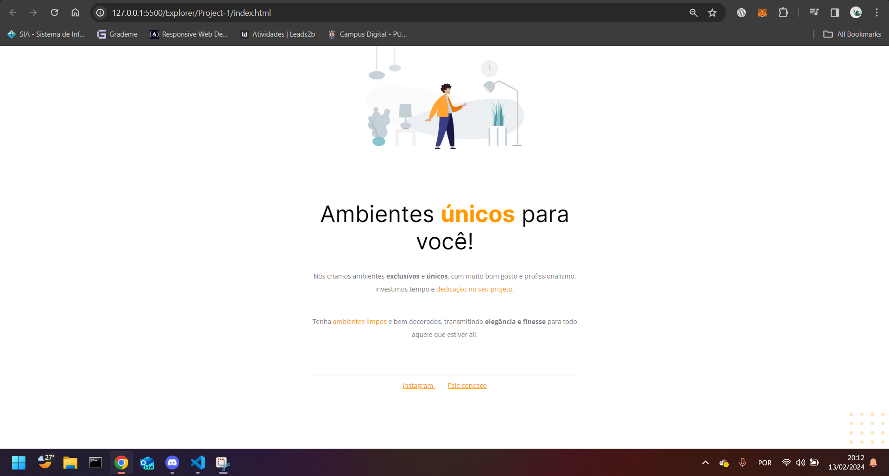

# Custom Furniture Project

## Description
This project was developed as part of the **Rocketseat** Explorer category course, under the guidance of instructor **Mayk Brito**.

## Technologies Used
- HTML5
- CSS3
- Google Fonts
- Responsive Design

## Features
- Exclusive design for unique environments
- Harmonious typography and colors
- High-quality images illustrating the concept of custom furniture
- Links for direct contact and social media

## Preview

## How to Use
To view the project, simply clone the repository to your local computer and open the `index.html` file in a browser of your choice.

## License
This project is licensed under the MIT License. See the LICENSE file for more details.

## Acknowledgments
Special thanks to instructor Mayk Brito and the Rocketseat team for providing an excellent learning experience.